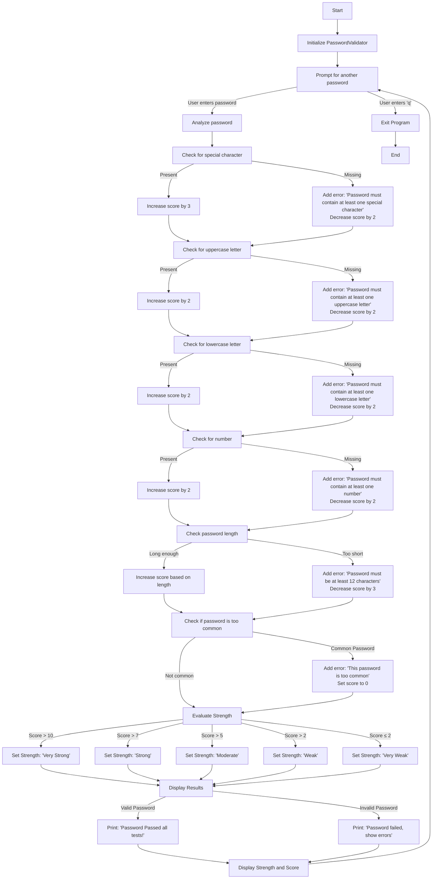

# Password-Strength-Tester
### A simple Cybersecurity project
A Python script to validate password strength and check against common passwords. It enforces complexity rules and provides a strength score.

# Flowchart

  

# Features:
Validates minimum password length (12 characters).

Requires uppercase, lowercase, numbers, and special characters.

Blocks common passwords (e.g., "password", "admin123")

Generates a strength score and feedback.

## Requirements
Python3
## Password Rules
Minimum length: 12 characters

Uppercase letter: At least 1 (A-Z)

Lowercase letter: At least 1 (a-z)

Number: At least 1 (0-9)

Special character: At least 1 from ~!@#$%^&{()_}.,":<>

Common passwords: Blocked (e.g., "123456", "password")
