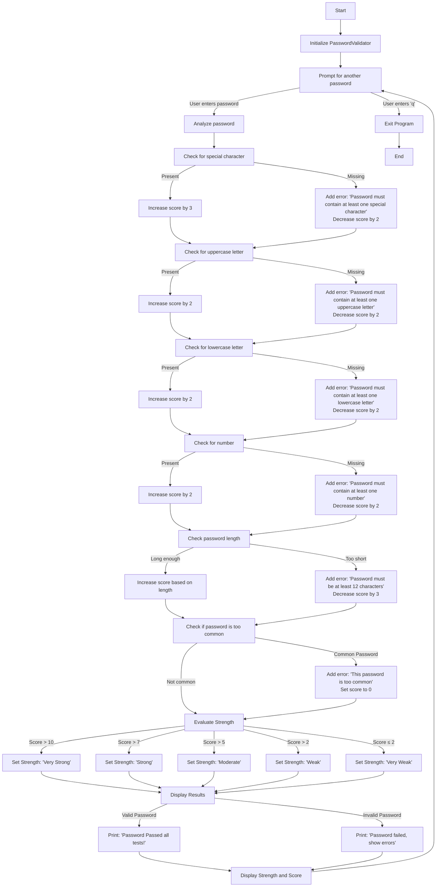

# Password-Strength-Tester
### A simple Cybersecurity project
A Python script to validate password strength and check against common passwords. It enforces complexity rules and provides a strength score.

# Flowchart

  

*For Mobile Users📱* -[ViewDigram](https://kroki.io/mermaid/svg/eNqVld1um0AQhe_7FNMr3zRSTBJVaqVIiX8A_yRWnaZSqS82sDEoeNfdXeK64gX6Hn2yPkmHWRwDIY7iC8tjzjkz38KyS8XWMdz0P78D_FwEc8OUWcDR0TlcBr5ITMLS5DeHGdN6I1V0i2XEjFQLMlySshfMlFytDWSaK7iXCtal3Kroq1dI86-FggvDlYbOz04O_WDwKzGAAUvFVosXpLu8HAbBhWDpFkdq6TGgcYZBL-bhAw2i1zxEBAhjpliIWVY9pA7TROtELHMYdoOLKAKulFSfoLODhVWmDYRSGJYIYAZSzvAPKfjz3M4P0eehQgFeDKXicLcFp9ptprhGHOzm4Mo2pScVjKFDHG6FI1uvuQoLR8rNHqNrhVS4dSb3zUzNHoeQ3DqS24bkVJBci-RVkFK5aUFyLZJHhVdH8t6M1OxxCMmrI3mvIXkWya8giWx1twPxLIhPhV8H8d8MYpMPje_Xx_dfG9-344_K8Xe7CXuKpYnLTMswomJEDW6kBB1LhS1Ghyju-B6g6-z3iW5lKJ9-22IixRI3vsyWMTZ5zoE_I1yU2qTWbpHGJVJyv6dKNBicPJSrlRRlMws3pmJMnXt0-elll8O4jngTJ_qFTMSac1OOaCQcLyq5V9KUshwmweCRpRkzHOZGNRHGdqgJFRMyzynyHLrHaO4GRZedEUe65Wpb1LhmnUWL6yOanKbpgP4M9SdN_VRGXOHErQ4HHadNxzfOHlrU__78Jf1ZK0bFZJ12MaZBP9HrlG3hC9dZanSZa-_21BYn1eK0WpyVBVVTKnI6xir3-QpPsESY6lNc_MDnjKUpGK6Nfl9OVib44rGRcf08454lKY8-FBtmYx8ijSkUc0Uxsye03VoAExHQYtl211ZnTbP6cVu8cpiQJubVE5eUjWOVfN-DgYgW_wGFU2-a)

# Features:
Validates minimum password length (12 characters).

Requires uppercase, lowercase, numbers, and special characters.

Blocks common passwords (e.g., "password", "admin123")

Generates a strength score and feedback.

# Requirements
Python3
## Password Rules
Minimum length: 12 characters

Uppercase letter: At least 1 (A-Z)

Lowercase letter: At least 1 (a-z)

Number: At least 1 (0-9)

Special character: At least 1 from ~!@#$%^&{()_}.,":<>

Common passwords: Blocked (e.g., "123456", "password")
